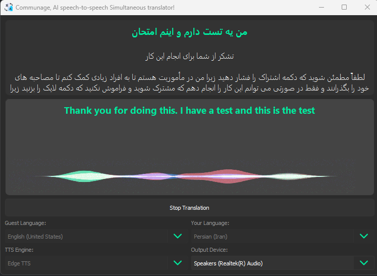

# 

## ⭐️ Communage: Your Ultimate AI Speech-to-Speech Simultaneous Translator! 🌐

Imagine having the superpower to speak any language in every voice or video call without breaking a sweat. Introducing **Communage**, the revolutionary AI speech-to-speech simultaneous translator that makes language barriers a thing of the past!

### Features
- **Speak Naturally**: Communicate in your native language effortlessly.
- **Universal Compatibility**: Seamlessly integrate with your favorite platforms like Skype, Teams, and more.
- **Real-Time Translation**: Enjoy smooth, instant translations during your conversations.

Whether you're closing international deals or catching up with friends around the world, Communage ensures you're always understood. Experience the future of communication today and join a global community without language limits.

### Supported Platforms
- **Windows**

**Note:** Mac and Linux support is on my to-do list and will be coming soon! feel free to fork and help me by your pull requests...

⭐️ **Star us on GitHub** and be part of this groundbreaking journey! 🚀

---

Let's break the language barrier together! 🌟
